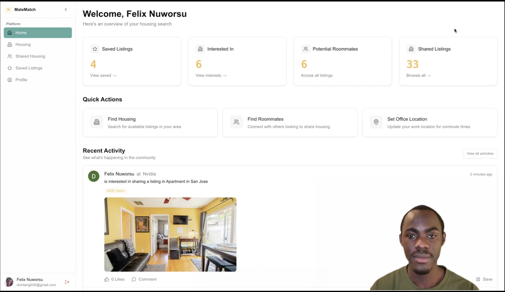

# MateMatch

MateMatch is a modern web application designed to help users find compatible roommates and shared housing opportunities. Built with Next.js 14 and Firebase, it provides a seamless experience for connecting people looking for shared living arrangements.

## Demo

[](https://youtu.be/p18uDLfRCgI)

> 💡 Click the image above to watch the full demo video on YouTube!

## Features

- 🏠 **Housing Listings**: Browse and manage shared housing opportunities
- 👥 **Roommate Matching**: Find potential roommates based on compatibility
- 🎯 **Smart Filtering**: Filter listings by location, price, and amenities
- 🗺️ **Location Intelligence**: View commute times and nearby amenities
- ⭐ **Saved Listings**: Save your favorite listings for later
- 💬 **Real-time Chat**: Communicate with potential roommates
- 🔔 **Activity Feed**: Stay updated with the latest housing opportunities
- 📱 **Responsive Design**: Optimized for desktop and tablet experiences

## Tech Stack

### Frontend
- **Framework**: Next.js 14, React 18, TypeScript
- **UI Components**: Shadcn/UI, Radix UI
- **Styling**: Tailwind CSS
- **Icons**: Lucide Icons
- **Maps**: Google Maps API

### Backend & Infrastructure
- **Authentication**: Firebase Auth
- **Database**: Firebase Firestore
- **Storage**: Firebase Storage
- **Functions**: Firebase Cloud Functions
- **Hosting**: Vercel

### Data & Integration
- **Data Scraping**: Puppeteer, Cheerio
- **Date Handling**: date-fns
- **State Management**: React Context, Firebase Hooks
- **Location Services**: Google Maps API, Distance Matrix API

## Getting Started

### Prerequisites

- Node.js 18 or higher
- npm or yarn
- Firebase account
- Google Cloud account (for Maps API)

### Installation

1. Clone the repository:
```bash
git clone https://github.com/tonaldo48/matematch.git
cd matematch
```

2. Install dependencies:
```bash
npm install
```

3. Create a `.env.local` file in the root directory and add your configuration:
```env
# Firebase Configuration
NEXT_PUBLIC_FIREBASE_API_KEY=your_api_key
NEXT_PUBLIC_FIREBASE_AUTH_DOMAIN=your_auth_domain
NEXT_PUBLIC_FIREBASE_PROJECT_ID=your_project_id
NEXT_PUBLIC_FIREBASE_STORAGE_BUCKET=your_storage_bucket
NEXT_PUBLIC_FIREBASE_MESSAGING_SENDER_ID=your_messaging_sender_id
NEXT_PUBLIC_FIREBASE_APP_ID=your_app_id

# Google Maps Configuration
NEXT_PUBLIC_GOOGLE_MAPS_API_KEY=your_google_maps_api_key

# Optional: Scraping Configuration
BRIGHT_DATA_USERNAME=your_bright_data_username
BRIGHT_DATA_PASSWORD=your_bright_data_password
```

4. Set up Firebase:
   - Create a new Firebase project
   - Enable Authentication (Email/Password and Google)
   - Create a Firestore database
   - Set up Firebase Storage
   - Deploy Firestore rules and indexes

5. Run the development server:
```bash
npm run dev
```

6. Open [http://localhost:3000](http://localhost:3000) in your browser.

## Development

### Available Scripts

- `npm run dev` - Start development server
- `npm run build` - Build for production
- `npm run start` - Start production server
- `npm run lint` - Run ESLint
- `npm run format` - Format code with Prettier

### Project Structure

```
matematch/
├── app/                # Next.js app directory
├── components/         # React components
├── lib/               # Utility functions and configurations
├── hooks/             # Custom React hooks
├── public/            # Static assets
└── types/             # TypeScript type definitions
```

## Contributing

We welcome contributions! Please follow these steps:

1. Fork the repository
2. Create a new branch: `git checkout -b feature/your-feature`
3. Make your changes
4. Run tests and linting
5. Commit your changes: `git commit -m 'Add some feature'`
6. Push to the branch: `git push origin feature/your-feature`
7. Submit a pull request

## License

This project is licensed under the MIT License - see the [LICENSE](LICENSE) file for details.

## Acknowledgments

- [Next.js](https://nextjs.org/)
- [Firebase](https://firebase.google.com/)
- [Shadcn/UI](https://ui.shadcn.com/)
- [Tailwind CSS](https://tailwindcss.com/)
- [Google Maps Platform](https://developers.google.com/maps)
